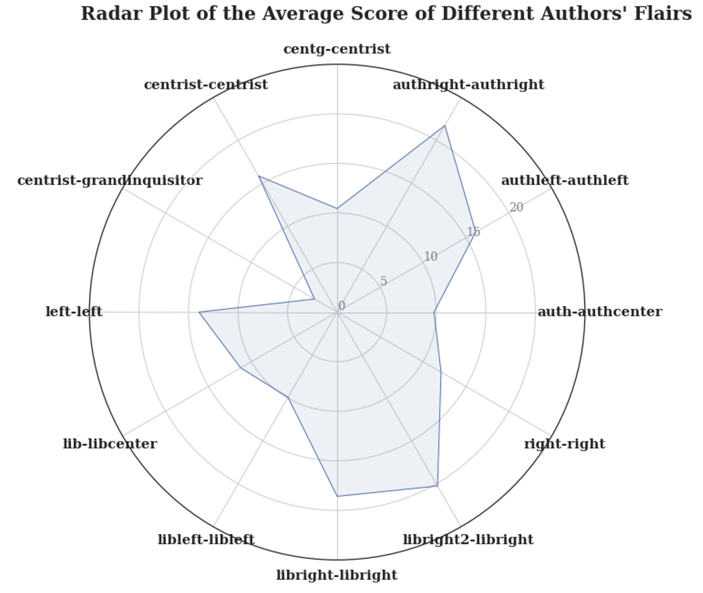
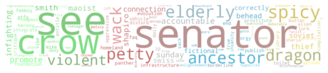
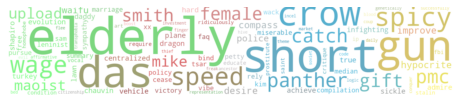
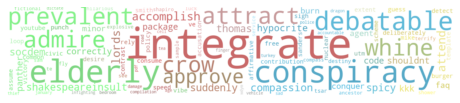
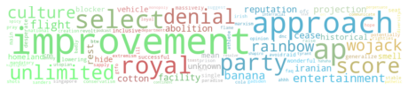
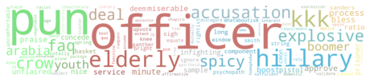
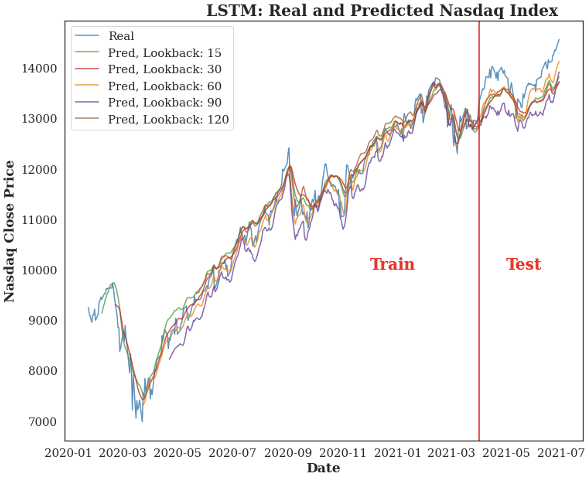

# Reddit-Analysis
The goal for this project is to conduct a sentiment analysis to classify the posts into different moods. We will explore millions of posts, classify them into different politic topics and then analyze the mood for all the posts under each topic, trying to tell the altitude of these posts.

## Code
**Exploratory Data Analysis:** [Link](project_eda.ipynb)
**Sentiment Analysis:** [Link](project_nlp.ipynb)
**Predictive Modeling:** [Link](project_ml.ipynb)

## SUMMARY
### Right Gains a Higher Post Score

The posts from right related author_flair type tend to have a higher score, no matter whether the posts are from authors of Authoritarian or Libertarian.

### Different Contents, Different Sentiments</strong>

COVID and Racial Equality related posts tend to have a larger proportion of negative sentiment, while Economics and Gender Equality related posts are likely to be more positive.

<table>
	<thead>
		<tr>
			<th colspan="5">Summary table by topic</th>
		</tr>
		<tr>
			<th>Sentiment</th>
			<th>Positive</th>
			<th>Neutral</th>
			<th>Negative</th>
			<th>Pos-Neg Ratio</th>
		</tr>
	</thead>
	<tbody>
		<tr>
			<td><strong>Covid</strong></td>
			<td>12548</td>
			<td>1813</td>
			<td>20020</td>
			<td>0.63</td>
		</tr>
		<tr>
			<td><strong>Election</strong></td>
			<td>20562</td>
			<td>2516</td>
			<td>21120</td>
			<td>0.97</td>
		</tr>
		<tr>
			<td><strong>Economics</strong></td>
			<td>62773</td>
			<td>4979</td>
			<td>52316</td>
			<td>1.20</td>
		</tr>
		<tr>
			<td><strong>Finance</strong></td>
			<td>13928</td>
			<td>1517</td>
			<td>13579</td>
			<td>1.03</td>
		</tr>
		<tr>
			<td><strong>Gender Equality</strong></td>
			<td>43667</td>
			<td>2021</td>
			<td>14229</td>
			<td>3.07</td>
		</tr>
		<tr>
			<td><strong>Racial Equality</strong></td>
			<td>98744</td>
			<td>15071</td>
			<td>157961</td>
			<td>0.63</td>
		</tr>
	</tbody>
</table>

### Different Topics, Different Keywords, Different Sentiments

LDA, one of the most famous topic modeling methods was utilized here to define a topic for each post. It can be recognized that some specific topics tend to be more positive, while some are not. Some keywords appear in more than one topic, so those unique words will explain more for the topics. The average Pos-Neg Ratio of all posts is 1.64, while the ratio of Topic 4 (more about accusation) is only 1.13, compared to 3.94 for Topic 3 (more about improvement)

	
	
	
	
	
<table>
	<thead>
		<th colspan="2">Summary Table of Topic (Average Pos-Neg Ratio: 1.64)</th>
	</thead>
	<tbody>
		<tr>
			<td></td>
			<td>Topic 0  
				Keywords: senator  
				Pos-Neg Ratio: 2.05</td>
		</tr>
		<tr>
			<td></td>
			<td>Topic 1  
				Keywords: short, das  
				Pos-Neg Ratio: 1.61</td>
		</tr>
		<tr>
			<td></td>
			<td>Topic 2  
				Keywords: integrate, conspiracy  
				Pos-Neg Ratio: 1.46</td>
		</tr>
		<tr>
			<td></td>
			<td>Topic 3  
				Keywords: improvement  
				Pos-Neg Ratio: 3.94</td>
		</tr>
		<tr>
			<td></td>
			<td>Topic 4  
				Keywords: officer, hillary, accusation  
				Pos-Neg Ratio: 1.13</td>
		</tr>
	</tbody>
</table>

### Posts' Moods Can Indeed Affect Stock Prices

Since political factor is always an essential feature of stock market, these subreddit posts may have an impact on the stock prices. According to the time series plot of Nasdaq Index, the predictions is pretty close to the real close prices. And the best model uses the last 60 days' historical data to make a prediction of the next day price.

